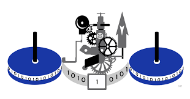

# Maquina de Turing

Breve descripcion o introduccion al proyecto, explicando de que se trata y que problemas soluciona.

## Tabla de Contenidos
- [Descripción](#descripción)
- [Instalación](#instalación)
- [Uso](#uso)
- [Documentación](#documentación)
- [Contribución](#contribución)
- [Créditos](#créditos)

## Descripción
Explicacion mas detallada del proyecto, sus características principales y el propósito. Si es necesario, agrega contexto, dependencias principales o conceptos clave relacionados.
#### Como funciona?
#### Que formato?
#### ?

## Instalacion
Instrucciones para instalar y configurar el proyecto. Puede incluir pasos como:

1. **Requisitos previos** (lenguajes, versiones, dependencias).

2. **Clonación del repositorio**:  
   ```bash
   git clone https://github.com/mae2033/turing-FTI.git

## Documentación
fotos de las maquinas 


